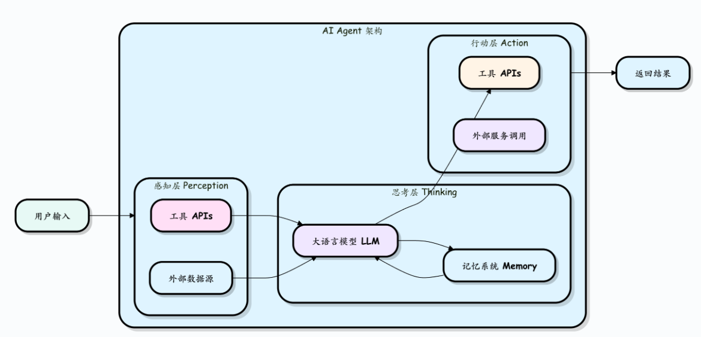
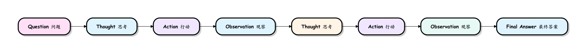

# AI-agent 智能体

agent 就是一个能干活的智能助手;
学习 agent 需要思维转变: 从对话框问答进化为目标驱动的任务执行;
agent = LLM (大脑) + Planning (规划) + Tool use (执行) + Memory (记忆).

- LLM (大脑): 作为核心推理机,负责理解意图,生成文本和进行逻辑判断.
- Planning (规划): 能够将复杂的目标(如"帮我策划一场技术沙龙")拆解成可执行的步骤.
- Memory (记忆): 记录对话历史(短期)和存储专业知识库(长期).
- Tool Use (工具使用): 能够根据需求去查谷歌搜索,读数据库,甚至跑 Python 代码.

## AI-agent工作流程

思考 -> 行动 -> 观察 -> 再思考... 的ReAct循环,就是 AI Agent 自主完成复杂任务的核心动力机制;

