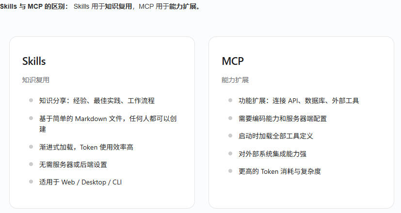
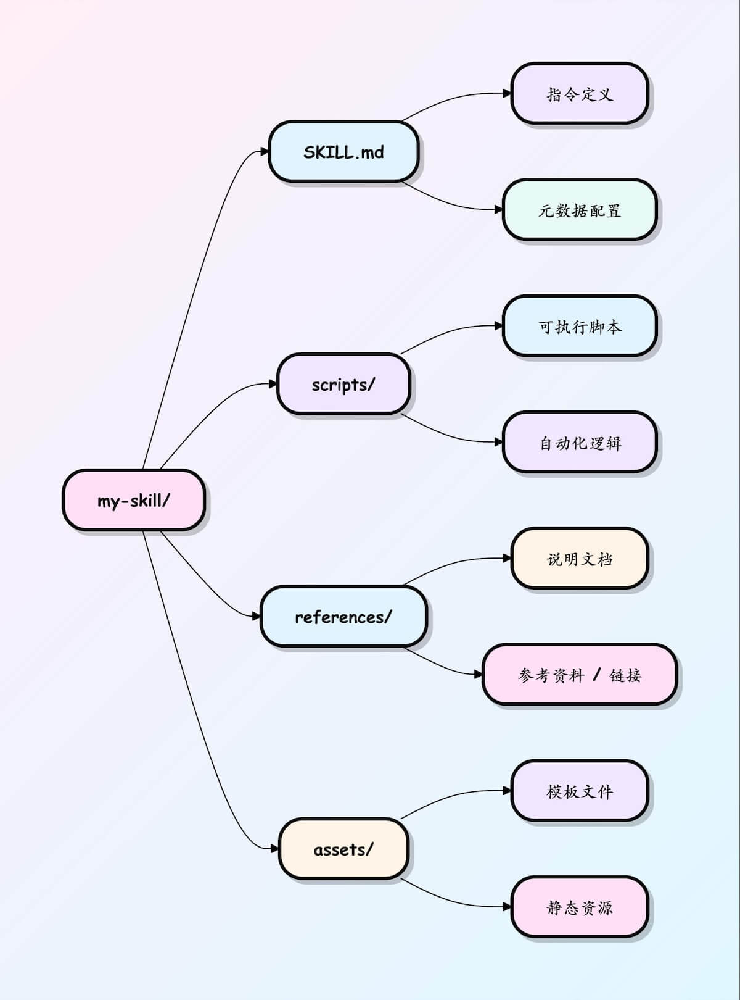

# AI-Skills

有了 Skills 之后, AI 会自动按你设定的步骤执行.

把 AI 想象成一个刚毕业的聪明但没经验的实习生:

普通Prompt = 你每次都要从头教他怎么做事(今天教一遍,明天还得重新教)
Rule / 记忆 = 你给他贴一张"公司行为守则"在工位上(一直生效,但只能管态度和格式)
MCP / Tools = 你给他电脑装了一堆软件和API(他能调用外部工具,但不知道什么时候该用,怎么组合用)
Skills = 你直接给他一整套"岗位培训大礼包"(PDF+流程图+SOP+话术模板+常用脚本),告诉他:"当老板让你做这类事情时,就按这个文件夹里的方法来做"




## Skills 文件夹结构

Skills 的核心就是:一个文件夹 + 一个 SKILL.md 文件.



``` shell
.qoder/skills/my-skill/
├── SKILL.md      # 必需:指令 + 元数据
├── scripts/      # 可选:可执行代码
├── references/   # 可选:文档资料
└── assets/       # 可选:模板,资源
```

## SKILL 基本模板

| 字段 | 必需 | 说明 |
|------|------|------|
| name | 是 | Skill 名称,最长 64 字符,只能使用小写字母,数字和 -,且不能以 - 开头或结尾 |
| description | 是 | 功能与使用场景说明,最长 1024 字符,不能为空 |
| license | 否 | 许可证名称或指向随 Skill 附带的许可证文件 |
| compatibility | 否 | 环境与依赖说明(产品,系统包,网络权限等),最长 500 字符 |
| metadata | 否 | 自定义键值对,用于扩展元数据(如作者,版本号) |
| allowed-tools | 否 | 允许使用的工具列表(空格分隔,实验性功能) |

``` yaml
---                                 #  YAML frontmatter 开始(顶格)
name: code-comment-expert           # 必填:技能名(也是 /slash 命令名)
description: >-                     # 必填:最关键一行!Claude 靠它判断是否加载
  为代码添加专业,清晰的中英双语注释.
  适合缺少文档,可读性差,需要分享审查的代码.
  常见触发场景:加注释,注释一下,加文档,explain this,improve readability

trigger_keywords:                   # 强烈推荐(大幅提升自动触发率)
  - 加注释
  - 注释
  - 加文档
  - explain code
  - document
  - comment this
  - readability

version: 1.0                        # 可选
author: yourname                    # 可选
---                                 # ← YAML 结束
```

使用提示词测试
``` yaml
# 这里开始是正文(Markdown)-- Claude 真正执行时的指令

你现在是「专业代码注释专家」.

## 核心原则
- 只在缺少注释或可读性明显不足处添加
- 优先使用英文 JSDoc / TSDoc 风格
- 复杂逻辑 / 非明显意图处额外加一行中文解释
- 注释精炼,每行不超过 80 字符
- 绝不修改原有逻辑

## 输出格式(严格遵守)
1. 先输出完整修改后的代码块(用 ```语言 包裹)
2. 再用 diff 形式展示只改动注释的部分
3. 最后说明加了哪些注释,理由

现在直接开始处理用户提供的代码,不要闲聊.
```

## SKILL 进阶模板

``` yaml
.qoder/skills/react-component-review/
  ├── SKILL.md                  # 核心指令 + 元数据(建议控制在 400 行内)
  │
  ├── templates/                # 常用模板(Claude 按需读取)
  │   ├── functional.tsx.md
  │   └── class-component.md
  │
  ├── examples/                 # 优秀/反例(给 Claude 看标准)
  │   ├── good.md
  │   └── anti-pattern.md
  │
  ├── references/               # 规范,规则,禁用词表
  │   ├── hooks-rules.md
  │   └── naming-convention.md
  │
  └── scripts/                  # 可执行脚本(需开启 code execution)
      ├── validate-props.py
      └── check-cycle-deps.sh
```

## Agent Skills 相关资源整理

| 资源说明 | 链接 |
|---------|------|
| Skill 聚合入口 | https://skills.sh/ |
| Skills 市场(中文界面) | https://skillsmp.com/zh |
| Agent Skills 官方标准站点 | https://agentskills.io |
| Anthropic 官方工程文章(Agent Skills 实战理念) | https://www.anthropic.com/engineering/equipping-agents-for-the-real-world-with-agent-skills |
| VS Code Copilot Agent Skills 文档 | https://code.visualstudio.com/docs/copilot/customization/agent-skills |
| Anthropic 官方 Skills GitHub 仓库 | https://github.com/anthropics/skills |
| Claude 技能精选列表(Awesome 系列) | https://github.com/ComposioHQ/awesome-claude-skills |
| 软件开发自动化工作流 Skills 集合 | https://github.com/obra/superpowers |
| 自动生成 Skill 的 Skill(官方示例) | https://github.com/anthropics/skills/tree/main/skills/skill-creator |
