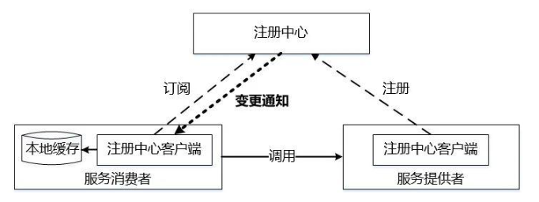

## 微服务架构

一个微服务架构包含如下三大角色:
1. 服务注册中心
2. 服务提供者
3. 服务消费者

### RPC 框架

一个客户端既可以作为服务提供者, 也可以作为服务消费者, 也可以都是;

**注册中心**:
   - 管理客户端实例;
       - 提供客户端注册/查询等功能;
   - 管理服务实例信息;
       - 提供服务注册/取消注册/监听/取消监听/查询/状态变更等功能;

**服务提供者**:
    - 在启动时, 会通过注册中心的客户端组件自动注册自己.
    - 提供服务;

**服务消费者**:
    - 在启动时, 会通过注册中心的客户端组件自动注册自己.
    - 调用服务;

**网络传输**: `Unix Socket + libhv`;

**自定义协议**: `包头 + 实际数据`;

**序列化**: `nanopb + proto`;

**负载均衡**: `随机`;

### 说明

**服务发现**: 从本地缓存或者注册中心找到对应服务的地址;
